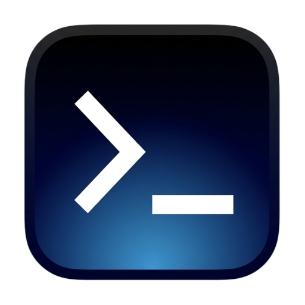

<div align="center">

  

  # ServerDeck — 远程服务器工作台

  面向 macOS 的桌面应用，聚焦 SSH、终端多标签页、SFTP 与应用内更新。

  [](https://github.com/qfxiongbinbin/serverdeck/releases)
  [](LICENSE)
  [](#)
  [](#)

  语言： [English](README.md) · [中文](README.zh-CN.md) · [日本語](README.ja.md)

</div>

ServerDeck 是一个面向 macOS 的远程服务器工作流桌面应用，基于 Tauri、React、TypeScript 和 Rust 构建。产品方向参考了 Termius 这类工具，当前优先聚焦于 SSH、终端多标签页和 SFTP 浏览。

## 当前范围

- 已保存主机管理
- 多标签终端会话
- 支持本地 / 远程双栏的 SFTP 浏览器
- 上传、下载、删除等文件操作
- 终端主题与字号设置
- 基于 GitHub Release 的更新检查与下载流程

当前仓库优先支持 macOS。

## 仓库结构

- `ServerDeck/` — 应用源码
- `ServerDeck/src/` — React UI、主题预设、API 封装与样式
- `ServerDeck/src-tauri/` — Rust 后端、Tauri 配置、图标与桌面命令
- 产品和技术规划文档维护在知识库 `工作/serverdeck/` 下
- `docs/release-process.md` — 版本发布与 GitHub Release 流程

## 本地开发

环境要求：

- Node.js `20+`
- Rust 工具链

本地运行：

```bash
cd ServerDeck
npm install
npm run tauri dev
```

常用命令：

```bash
npm run build                  # 前端构建
./node_modules/.bin/tsc --noEmit
cd src-tauri && cargo check
```

## 打包

构建 macOS 安装产物：

```bash
cd ServerDeck
npm run tauri build
```

当前配置的打包目标包括：

- `.app`
- `.dmg`

## 发布与更新

发布通过 GitHub Actions 基于 Git tag 构建。桌面应用会在启动时检查最新的 GitHub Release，只有发现新版本时才会显示 `Update` 按钮。

发布步骤文档见：

- `docs/release-process.md`

## 说明

- 当前通过 GitHub 分发的 macOS 构建，在其他机器上顺畅安装仍可能需要完善 Apple 签名与公证。
- 贡献协作流程请参考 `AGENTS.md`。

## 开源协议

本项目采用 Apache License 2.0 开源，详见 `LICENSE`。
